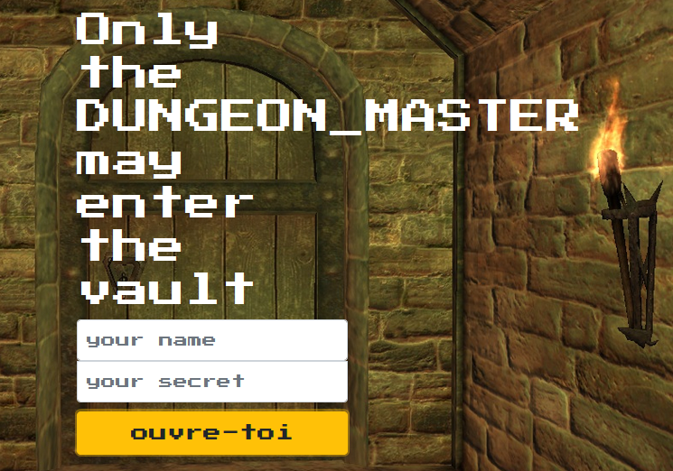

# SwampCTF

> The University of Florida Student InfoSec Team (UFSIT) is hosting the 1st annual SwampCTF!

- When: March 29th 18:00 → March 31st 18:00 EDT (2018)
- Where: Online - https://play.swampctf.com/
- CTF Type: Jeopardy
- Categories: Pwn, Reverse, Forensics, Crypto, and Misc.
- Flag Format: flag{[a-zA-Z0-9_-]{12,40}} 

## The Vault:

> Has it been days? Weeks? You can't remember how long you've been standing at the door to the vault.
> You can't remember the last time you slept or ate, or had a drop of water, for that matter.
> But all of that is insignificant, in the presence of the untold fortunes that must lie just beyond the threshold.
> But the door. It won't budge. It says it will answer only to the DUNGEON_MASTER.
> Have you not shown your worth?
> But more than that,
> It demands to know your secrets.
> 
> Nothing you've tried has worked.
> You've pled, begged, cursed, but the door holds steadfast, harshly judging your failed requests.
> 
> But with each failed attempt you start to notice more and more that there's something peculiar about the way the door responds to you.
> 
> Maybe the door knows more than it's letting on.
> ...Or perhaps it's letting on more than it knows?
> 
> NOTE: DO NOT USE AUTOMATED TOOLS
> Connect
> http://chal1.swampctf.com:2694

### Solución:

Nos conectamos a la URL y vemos un formulario web para hacer login, ambientado en el juego de Dragones y Mazmorras.



Intentamos entrar con unas credenciales de prueba.

```
No such user: test
No such user: admin
```

El enunciado nos da la pista que la puerta responderá solo ante el maestro de la mazmorra (DUNGEON_MASTER), veamos la respuesta en este caso con la contraseña `test`.

```
test_hash [9f86d081884c7d659a2feaa0c55ad015a3bf4f1b2b0b822cd15d6c15b0f00a08] does not match real_hash[40f5d109272941b79fdf078a0e41477227a9b4047ca068fff6566104302169ce]
```

Con el hash de prueba y el que tenemos que generar, identificamos primero el tipo y luego lo crackeamos con John The Ripper.

```
$ hashid 40f5d109272941b79fdf078a0e41477227a9b4047ca068fff6566104302169ce
Analyzing '40f5d109272941b79fdf078a0e41477227a9b4047ca068fff6566104302169ce'
[+] Snefru-256 
[+] SHA-256 
[+] RIPEMD-256 
[+] Haval-256 
[+] GOST R 34.11-94 
[+] GOST CryptoPro S-Box 
[+] SHA3-256 
[+] Skein-256 
[+] Skein-512(256) 
```
Nos sugiere diferentes cifrados, el más común es `SHA256` por lo que nos centramos en el, en este caso es correcto. La contraseña en plano corresponde a "smaug123". Una vez introducida obtenemos la flag correcta:

**flag{somewhere_over_the_rainbow_tables}**

## Wild Night Out:

> That sure was a wild night at the old tavern.
> Good thing someone was able to draw the scene for us to remember.
> But the more I look at the picture, the more it seems that something isn't quite right...

## Secret Plans:

> Some orcs were caught in the area transporting secret plans, only problem is we cant read them. Can you?